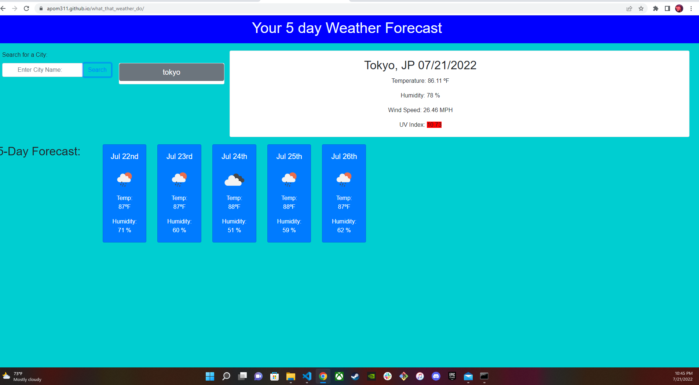

# what_that_weather_do

GIVEN A simple webpage that gives user basic weather information on their selected city or town
WHEN a City is entered
THEN current and future weather data is presented
WHEN search is completed
THEN a new button appears for quick re-submission

a very basic form of weather app that (while simple) is plenty effective
currently the appended list function is not able to tell the difference between a successful submission and a failed one

Notes added throughout the html and js files for easier viewing

(live page)[https://apom311.github.io/what_that_weather_do/]
(repo)[https://github.com/Apom311/what_that_weather_do]
